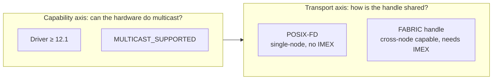

> **TL;DR**  
> "Does this machine support NVLS?" sounds like a yes/no question. In practice, the answer has at least five layers: hardware capability, handle transport, IMEX provisioning, NCCL policy, and the runtime's own allocator.  
> We compressed those layers into one `supported()` function. That fixed an NCCL hang, but quietly disabled the single-node POSIX-FD NVLS fast path.  
> This post walks through a real CI failure: from a confusing dtype error, all the way down to NVSwitch, fabric handles, and `NCCL_NVLS_ENABLE`.

---

## Opening: An Error That Answered the Wrong Question

One Tuesday, CI turned red. The test was called `test_mnnvl_nvfp4_rejects_fp32_before_launch`. Long name, simple intent: **if NVFP4 MNNVL AllReduce receives FP32 input, it should fail early, before launching the kernel, with a friendly error.**

The test expected this message:

```text
NVFP4 quantization requires FP16 or BF16
```

Instead, it got this:

```text
fp4_quantize only supports input tensor with dtypes fp16/bf16/e4m3.
```

When reproduced locally on H200, the error could look even stranger:

```text
cudaLaunchKernelEx(... rms_norm_kernel<float...>): no kernel image is available for execution on the device
```

These three errors point in completely different directions: dtype validation, quantization, RMS norm. They look like unrelated modules failing in unrelated ways.

**But there was only one root cause: the dedicated MNNVL AllReduce object was never constructed.** The code silently fell back to a generic path, and the later errors were just stand-ins from that fallback path.

That is the story of this post: **how a dtype assertion led us to NVLS, POSIX file descriptors, fabric handles, and NCCL environment variables.**

---

## Act 1: What Are We Actually Talking About?

Before reading logs, it helps to put four names on the table. They are often discussed together, but they are not the same thing.

### NVLS: Let NVSwitch Do Some of the Work

In a normal AllReduce, every GPU sends data, receives data, and participates in reduction. Data moves back and forth over NVLink.

**NVLS (NVLink SHARP)** changes the model: the **NVSwitch chip itself** participates in fan-out and reduction while data flows through the switch. The runtime registers memory as a **multicast memory object**, and the hardware helps move and reduce data more efficiently.

In public NVIDIA materials, the [NVLink / NVSwitch overview](https://www.nvidia.com/en-us/data-center/nvlink/) describes this class of capability as *SHARP in-network reductions* and *multicast acceleration*. The [CUDA Driver API: Multicast Management](https://docs.nvidia.com/cuda/cuda-driver-api/group__CUDA__MULTICAST.html) exposes the programming interface: `cuMulticastCreate`, `cuMulticastAddDevice`, `cuMulticastBindMem`, `cuMemMap`, and related calls.

To use NVLS, you need at least the following:

| Requirement | How to check | Public reference |
|-------------|--------------|------------------|
| Recent enough driver | CUDA ≥ 12.1 | [CUDA Programming Guide: VMM](https://docs.nvidia.com/cuda/cuda-programming-guide/04-special-topics/virtual-memory-management.html) |
| Hardware multicast support | `CU_DEVICE_ATTRIBUTE_MULTICAST_SUPPORTED` | Same guide; Hopper (H100/H200) plus NVSwitch topology |
| A way for ranks to exchange memory handles | See the next section | POSIX-FD / FABRIC examples in the VMM docs |
| Kernels compiled for the target architecture | `nvcc` / build configuration | Standard CUDA deployment practice |

**Key point:** `MULTICAST_SUPPORTED == true` only says that the GPU and topology *have the capability*. It does not guarantee that the current software environment has been fully provisioned for every transport path. This distinction will show up again and again.

### NCCL NVLS ≠ The Runtime's Own NVLS Buffer

[NCCL](https://docs.nvidia.com/deeplearning/nccl/) is a collective communication library. Internally, it may choose NVLS as an acceleration path for AllReduce and other collectives. The [`NCCL_NVLS_ENABLE`](https://docs.nvidia.com/deeplearning/nccl/archives/nccl_2303/user-guide/docs/env.html) environment variable controls that path:

| Value | Meaning |
|-------|---------|
| `0` | Disable NVLS; do not allocate NVLink SHARP resources |
| `1` | Enable NVLS; communicator initialization may fail if resources cannot be allocated |
| `2` | Default in newer NCCL versions; behavior may resemble `1` on resource allocation failure to avoid some ranks falling back while others do not |

But many inference runtimes, including TensorRT-LLM, also allocate their **own** multicast buffers for fused GEMM + AllReduce, dedicated AllReduce kernels, or other communication optimizations. That memory does **not necessarily go through NCCL's allocator**.

So it is entirely possible for both of these statements to be true on the same machine:

```text
NCCL NVLS algorithm:      too risky to enable because fabric is not provisioned
Runtime NVLS buffer:      usable through the single-node POSIX-FD path
```

That is not a contradiction. It is two implementations with different risk boundaries.

### MNNVL: The Name Says Multi-Node, But the Path May Be Single-Node

**MNNVL (Multi-Node NVLink)** usually refers to communication over a multi-node NVLink fabric. In code, however, a class named `MNNVLAllReduce` may serve two paths:

- A real multi-node fabric path, which requires FABRIC handles.
- A single-node NVLS multicast path, which can use POSIX-FD.

In the failing test, `TLLM_TEST_MNNVL=1` forced the MNNVL class to be used, but `mapping.is_multi_node()` was false. In other words, **the test was exercising single-node NVLS, not cross-node fabric.**

---

## Act 2: Two Keys, Two Worlds

An NVLS multicast allocation answers two **orthogonal** questions.



### POSIX-FD: Passing the Key Between Processes on One Host

`CU_MEM_HANDLE_TYPE_POSIX_FILE_DESCRIPTOR` represents a memory handle as a **Unix file descriptor**. Processes on the same host can pass that FD through a Unix domain socket using `SCM_RIGHTS`.

Properties:

- ✅ Single-node multi-GPU / multi-process
- ✅ Does **not** require NVLink fabric / IMEX
- ❌ Cannot cross machines (an FD is a local kernel object)

The standard flow in the [CUDA VMM documentation](https://docs.nvidia.com/cuda/cuda-programming-guide/04-special-topics/virtual-memory-management.html) is:

1. `cuMemCreate` creates the allocation  
2. `cuMemExportToShareableHandle` exports it as a POSIX-FD  
3. The peer imports it with `cuMemImportFromShareableHandle`  

This is a public CUDA IPC mechanism, not a private framework trick. **For a single-node NVLS allocator, this is a natural path.**

### FABRIC Handle: Passing the Key Across Nodes

`CU_MEM_HANDLE_TYPE_FABRIC` is an opaque token that can be propagated across an NVLink fabric domain. It depends on system-level components:

- Fabric Manager  
- **IMEX** (the `nvidia-imex` service)  
- IMEX channel device nodes visible to the application  

The [IMEX Overview](https://docs.nvidia.com/multi-node-nvlink-systems/imex-guide/overview.html) explains that IMEX coordinates GPU memory export/import across OS and node domains. [IMEX Channels](https://docs.nvidia.com/multi-node-nvlink-systems/imex-guide/imexchannels.html) describes the `/dev/nvidia-caps-imex-channels/channelN` devices and their user isolation / permission requirements.

The [CUDA Driver API: VA](https://docs.nvidia.com/cuda/cuda-driver-api/group__CUDA__VA.html) also states that using fabric handles requires access to the corresponding IMEX channel.

> **A public pitfall (from the forums)**  
> In this [NVIDIA Developer Forum discussion](https://forums.developer.nvidia.com/t/cudevicegetattribute-shows-i-can-use-fabric-handle-but-actually-i-cannot/336426), the key lesson is simple:  
> *an attribute saying fabric handles are supported means the device can create such handles; it does not mean the system has completed fabric-handle IPC provisioning.*

### Quick Comparison

| | POSIX-FD | FABRIC handle |
|---|----------|---------------|
| Scope | Single-node | Single-node and cross-node |
| Requires IMEX | No | Yes (for cross-node scenarios) |
| Typical use | Multi-GPU inference on one host | GB200 NVL72, multi-node NVLink domains |
| Relationship | **Not a fallback; a topology choice** | Same |

---

## Act 3: A Well-Intentioned Fix With an Unintended Regression

The story goes back to [PR #15302](https://github.com/NVIDIA/TensorRT-LLM/pull/15302) (*Fall back to NVLink P2P when NVLS fabric is unprovisioned*).

### The Real Problem PR 15302 Was Solving

On nodes where **fabric / IMEX is not provisioned** (for example, `nvidia-imex` is not running, or the cap devices are not exposed inside the container), NCCL can still detect a multicast-capable topology and try to bind NVLS multicast memory during `ncclCommInitRank`.

That bind can fail. The CUDA context may then enter a **sticky error state**. The first later collective may surface only a generic `unhandled cuda error`, or the program may hang.

[NCCL GitHub Issue #2077](https://github.com/NVIDIA/nccl/issues/2077) shows a public example: logs contain `Failed to bind NVLink SHARP (NVLS) Multicast memory...`, and the workaround is to set `NCCL_NVLS_ENABLE=0`.

The fix in PR 15302 was reasonable for that problem: upgrade `ipcNvlsSupported()` from a static capability check into **static capability plus a fabric live probe**. If the probe fails, set this before `ncclCommInitRank`:

```bash
# Only set this if the user did not set it explicitly; flag=0 means do not overwrite existing env vars
export NCCL_NVLS_ENABLE=0
```

The [NVIDIA Multi-Node NVLink NCCL Tuning Guide](https://docs.nvidia.com/multi-node-nvlink-systems/multi-node-tuning-guide/nccl.html) also notes that disabling NVLS can be appropriate in some environments.

### The Unintended Side Effect: One Ruler Measured Every Path

The problem was that **the same `ipcNvlsSupported()` function was also used as the entry guard for the runtime's own `ipcNvlsAllocate()` path.**

Original meaning:

```text
ipcNvlsSupported()
  = driver is new enough
    && every device reports MULTICAST_SUPPORTED
```

After PR 15302:

```text
ipcNvlsSupported()
  = all of the above
    && fabric handle can be allocated / exported / imported   ← live probe
```

For NCCL, this is a conservative and correct gate.  
For the **single-node POSIX-FD allocator**, it is an accidental over-gate. That allocator does not need fabric, but it is rejected before it ever reaches the POSIX-FD logic.

The valid world should have looked like this:

```text
static multicast capability:   true
fabric handle usable:          false
single-node POSIX-FD path:     still usable ✅
```

After PR 15302, it became this:

```text
ipcNvlsSupported() → false
→ allocator throws immediately
→ MNNVLAllReduce construction fails
→ code silently falls back to AUTO / generic allreduce
→ the user sees downstream stand-in errors such as fp4_quantize or no kernel image
```

---

## Act 4: Follow the Call Stack

Once the failure chain is drawn out, the final error no longer looks mysterious:

```text
AllReduce initialization
  └─ try to construct MNNVLAllReduce
       └─ create multicast workspace
            └─ ipcNvlsAllocate()
                 └─ ipcNvlsSupported()  ← fabric probe fails, returns false
                      └─ exception! POSIX-FD never gets a chance
  └─ upper layer catches and silently falls back

forward()
  └─ no dedicated MNNVL object
  └─ tunable_allreduce → generic path
  └─ fp4_quantize / rms_norm error  ← the visible "culprit" is just a bystander
```

**Debugging lesson:** for communication failures, the final exception is often not the root cause. Go back to the initialization path and ask three questions:

1. Was the dedicated communication object constructed successfully?  
2. Was a construction failure **swallowed silently**?  
3. Is a `supported()` helper being reused by callers with different semantics?

---

## Act 5: What the Correct Fix Looks Like

The right fix is not simply "flip the boolean back." The right fix is to **split the semantics**.

```text
ipcNvlsSupported()
  = static multicast capability
  = driver / device / topology say multicast is possible

ipcNvlsFabricUsable()
  = ipcNvlsSupported()
    && fabric handle live probe succeeds
```

The relationship is:

```text
fabricUsable ⇒ supported        (one-way implication)
supported ⇏ fabricUsable        (the converse does not hold)

fabricUsable == false
  ⇏  all NVLS paths are unavailable
  ⇒  only the fabric-handle path is unavailable; single-node POSIX-FD may still be OK
```

### Which Caller Should Use Which Check?

| Caller | Should use | Why |
|--------|------------|-----|
| `ipcNvlsAllocate()`, Python `ipc_nvls_supported`, GEMM tests | `ipcNvlsSupported()` | They only need static capability up front; the allocator can choose POSIX-FD or FABRIC internally |
| NCCL `getComm()` when deciding `NCCL_NVLS_ENABLE` | `ipcNvlsFabricUsable()` | Avoid letting NCCL enter a known-bad NVLS bind path when fabric is unprovisioned |
| Feature gates / unit tests | Make the required layer explicit | "Can allocate a runtime buffer" and "can enable NCCL NVLS" are different questions |

### Why Not Just Allow NCCL NVLS on Single-Node Jobs?

A natural question is: if the runtime can use POSIX-FD for single-node NVLS, can NCCL also remain enabled on single-node jobs?

**You cannot infer that directly.**

1. **Different implementation** — NCCL's NVLS bind logic is not the runtime allocator. POSIX-FD working in the runtime does not prove NCCL will take the same path.  
2. **Observed failure mode** — in some single-node environments without IMEX, NCCL still attempts NVLS bind and leaves the CUDA context in a bad state. The right question is *whether NCCL can safely complete its own multicast bind in this process environment*, not node count.

Until there is stronger evidence, using `ipcNvlsFabricUsable()` as a conservative gate for NCCL is a reasonable engineering tradeoff: **it may lose one performance path, but it preserves stable and predictable initialization behavior.**

---

## Act 6: A Practical Debugging Playbook

This checklist is not a report appendix. It is the kind of playbook you can keep next to your terminal. Follow it in order, and a vague "NVLS does not work" usually turns into a set of smaller, testable questions.

### Step 0: Identify Which Path You Are Debugging

```bash
# Are you using NCCL's NVLS algorithm,
# or the runtime's own multicast allocator?
# The answers can differ — separate them first.
```

### Step 1: Check Static Capability

```bash
# Example: inspect the driver with nvidia-smi;
# query MULTICAST_SUPPORTED inside the application.
# Public API: cuDeviceGetAttribute(..., CU_DEVICE_ATTRIBUTE_MULTICAST_SUPPORTED, ...)
```

- [CUDA VMM documentation](https://docs.nvidia.com/cuda/cuda-programming-guide/04-special-topics/virtual-memory-management.html) — overview of multicast and shareable handles  
- [Multicast Management API](https://docs.nvidia.com/cuda/cuda-driver-api/group__CUDA__MULTICAST.html) — `cuMulticastCreate` and related APIs

### Step 2: POSIX-FD or FABRIC?

For single-node multi-process jobs with no cross-node requirement, suspect and validate the **POSIX-FD path** first. Do not let a failed fabric probe automatically rule it out.

For cross-node MNNVL, you must check **FABRIC + IMEX**:

```bash
# Is the IMEX service running?
# The exact command depends on deployment; follow the IMEX docs for your system.
systemctl status nvidia-imex   # example; environment may differ

# Are channel devices visible to the current user/container?
ls -l /dev/nvidia-caps-imex-channels/
```

- [IMEX Overview](https://docs.nvidia.com/multi-node-nvlink-systems/imex-guide/overview.html)  
- [IMEX Channels configuration](https://docs.nvidia.com/multi-node-nvlink-systems/imex-guide/imexchannels.html)

### Step 3: NCCL Side

```bash
# Explicitly disable NVLS — a common public debugging workaround
export NCCL_NVLS_ENABLE=0

# Then check init logs for NVLS / SHARP / multicast bind errors
```

- [`NCCL_NVLS_ENABLE` documentation](https://docs.nvidia.com/deeplearning/nccl/archives/nccl_2303/user-guide/docs/env.html)  
- [NCCL Issue #2077](https://github.com/NVIDIA/nccl/issues/2077) — bind failure case  
- [Multi-Node NVLink NCCL Tuning Guide](https://docs.nvidia.com/multi-node-nvlink-systems/multi-node-tuning-guide/nccl.html)

### Step 4: Do Not Be Fooled by Fallback

| Symptom | Possible truth |
|---------|----------------|
| dtype / quant / kernel image error | Dedicated AllReduce was not constructed; execution fell into a generic path |
| CUDA error only at the first collective | NVLS bind may have failed during init and dirtied the context |
| Test says "regex did not match" | The error came from a different path, so the message naturally differs |

**Logs should distinguish three states:** fast path succeeded, fast path failed and fell back, fallback itself failed.

### Step 5: Semantics Unit Tests Should Lock Down (for maintainers)

```text
fabricUsable  ⇒  multicastSupported
multicastSupported  ⇏  fabricUsable
single-node POSIX-FD allocator must not be gated by a fabric probe
NCCL policy should use fabricUsable, not static capability
```

---

## Closing: One `if`, Five Meanings

Back to the deceptively simple question from the beginning: "Does this machine support NVLS?"

An honest answer includes at least these layers:

1. **Static multicast capability** — do the hardware and driver have the card?  
2. **Single-node POSIX-FD path** — can local processes pass the key?  
3. **Fabric / IMEX usability** — can the key cross nodes?  
4. **NCCL policy** — should NCCL be allowed to bind NVLS resources?  
5. **Runtime allocator policy** — which path should our own multicast buffer use?

If all of those are squeezed into one `supported()` function, one fix can easily become another path's regression. A better design gives the layers names and keeps live probes scoped to the callers that actually need them:

```text
hasMulticastCapability()       # does the hardware have the card?
canUseFabricHandle()           # can the fabric key be used?
shouldEnableNcclNvls()         # is NCCL safe to try?
canAllocateRuntimeNvlsBuffer() # can our allocator proceed?
```

In high-performance communication systems, these **semantic boundaries** often matter more than another clever kernel. Users will not remember how elegant your multicast bind was. They will remember that CI turned red on Tuesday, and the error looked like it had nothing to do with NVLS.

---

## Further Reading

| Topic | Link |
|-------|------|
| CUDA VMM, POSIX-FD / FABRIC handles | [Programming Guide: VMM](https://docs.nvidia.com/cuda/cuda-programming-guide/04-special-topics/virtual-memory-management.html) |
| Multicast object API | [Driver API: Multicast Management](https://docs.nvidia.com/cuda/cuda-driver-api/group__CUDA__MULTICAST.html) |
| Shareable handles and IMEX permissions | [Driver API: VA](https://docs.nvidia.com/cuda/cuda-driver-api/group__CUDA__VA.html) |
| `NCCL_NVLS_ENABLE` | [NCCL Env Vars](https://docs.nvidia.com/deeplearning/nccl/archives/nccl_2303/user-guide/docs/env.html) |
| NCCL tuning on Multi-Node NVLink systems | [NCCL Tuning Guide](https://docs.nvidia.com/multi-node-nvlink-systems/multi-node-tuning-guide/nccl.html) |
| IMEX service | [IMEX Overview](https://docs.nvidia.com/multi-node-nvlink-systems/imex-guide/overview.html) |
| IMEX channel devices | [IMEX Channels](https://docs.nvidia.com/multi-node-nvlink-systems/imex-guide/imexchannels.html) |
| NVLink / NVSwitch / SHARP | [NVIDIA NVLink](https://www.nvidia.com/en-us/data-center/nvlink/) |
| Fabric attribute vs actual provisioning | [Developer Forum discussion](https://forums.developer.nvidia.com/t/cudevicegetattribute-shows-i-can-use-fabric-handle-but-actually-i-cannot/336426) |
| NVLS bind failures and disabling NVLS | [nccl#2077](https://github.com/NVIDIA/nccl/issues/2077) |

---

*This post is based on a real TensorRT-LLM debugging case involving NVLS / MNNVL. API and configuration behavior are described according to NVIDIA public documentation.*
